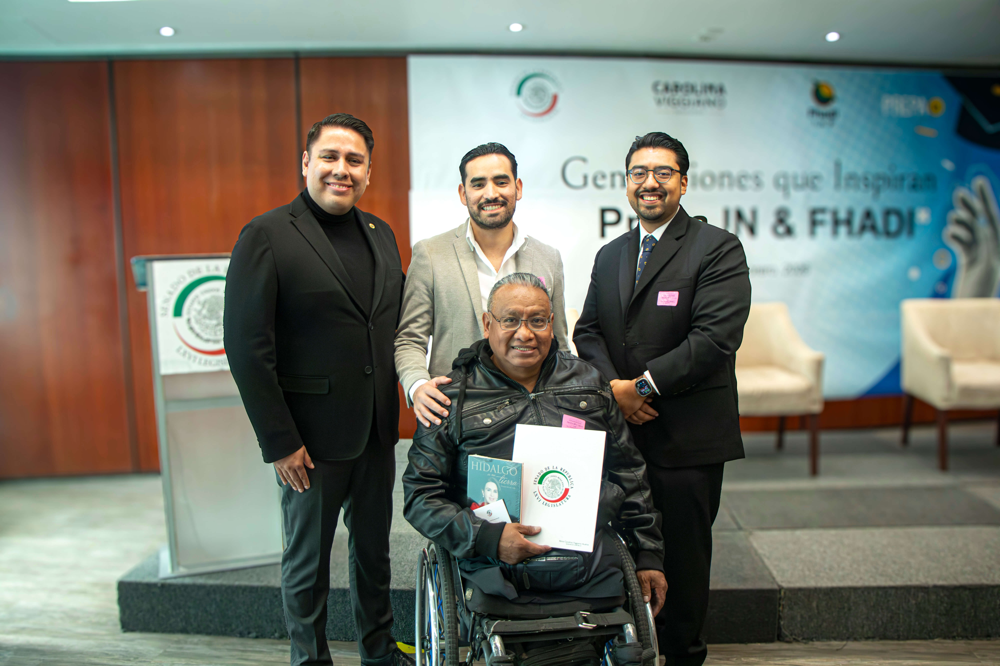
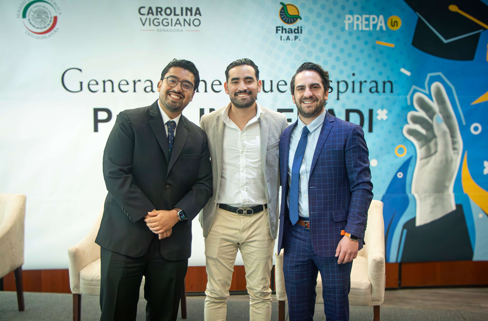
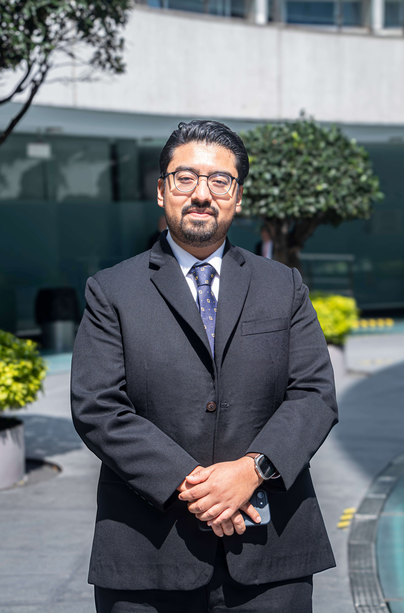

Hay momentos que te recuerdan por qué haces lo que haces. La graduación de 19 jóvenes con discapacidad en el Senado de la República fue uno de esos momentos.

Ver a estas personas recibir su certificado de bachillerato, en uno de los recintos más importantes del país, fue algo que no voy a olvidar. No solo por la ceremonia en sí, sino por todo lo que representa: meses de trabajo, de clases, de esfuerzo — tanto de los estudiantes como de todo el equipo detrás.

## Prepa IN y la educación inclusiva

[Prepa IN](https://prepain.mx) nació con una idea simple pero poderosa: que la educación no debería tener barreras. Que una persona con discapacidad motriz tiene el mismo derecho a terminar su preparatoria que cualquier otra persona.

Este proyecto no sería posible sin la colaboración con [FHADI México](https://www.linkedin.com/in/fhadi-mexico-55a160209/) y el liderazgo de [Román Maldonado Jiménez](https://www.linkedin.com/in/rom%C3%A1n-maldonado-jim%C3%A9nez-a15a19b1/), su Director General. FHADI ha sido un aliado fundamental para abrir caminos donde antes solo había barreras.

## La ceremonia en el Senado

La [senadora Carolina Viggiano](https://www.linkedin.com/in/caroviggianohgo/) nos recibió en el Senado de la República y fue anfitriona de la graduación. Su respaldo institucional le dio a la ceremonia un peso especial — no solo por el lugar, sino por el mensaje que envía: la inclusión educativa importa, y las instituciones pueden (y deben) ser parte de esta conversación.

Ver a los 19 graduados en ese recinto fue un recordatorio de que la inclusión no es un favor, es un derecho.

## El equipo que lo hace posible

Nada de esto pasa sin el equipo. Agradezco a mis socios [Rodrigo Loeza](https://www.linkedin.com/in/rodrigo-loeza-king-b401b7102/), CEO de [Prepa IN](https://prepain.mx), y [Arath Galván](https://www.linkedin.com/in/galvanarathiam/), así como a [Lizbeth Palacios González](https://www.linkedin.com/in/lizbeth-palacios-gonz%C3%A1lez-788976208/) y a todo el equipo por su profesionalismo y vocación. Cada clase, cada adaptación, cada estudiante que llega a la meta es resultado de su compromiso.

Gracias también a todo el equipo de FHADI, que día a día trabaja para que la educación accesible sea una realidad en México.

## Lo que sigue

Seguimos trabajando para que la educación deje de ser un privilegio y se convierta en una oportunidad real para todos. Este es solo el comienzo.

Si quieres ver el video completo de la ceremonia, puedes verlo aquí:

<iframe width="100%" style="aspect-ratio:16/9" src="https://www.youtube.com/embed/KK3DXz3qcC8" title="Graduación Prepa IN en el Senado de la República" frameborder="0" allow="accelerometer; autoplay; clipboard-write; encrypted-media; gyroscope; picture-in-picture; web-share" allowfullscreen></iframe>

Si conoces a alguien que podría beneficiarse de este programa, visita [prepain.mx](https://prepain.mx).

También compartí este momento en mis redes sociales:

- [Publicación en X (Twitter)](https://x.com/baezor/status/2021419252486721710)
- [Publicación en Instagram](https://www.instagram.com/p/DUlV-SrEaed/)
- [Prepa IN en LinkedIn](https://www.linkedin.com/company/prepa-in/)
